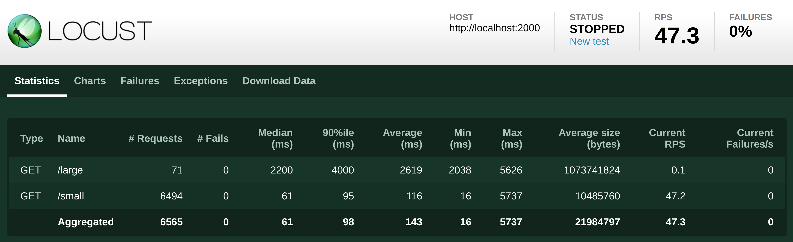

# Simple Web File Server
## Description
A simple web file server.
Only HTTP 1.1 is supported! 

Contact: shen_teng@engineering.ucla.edu or make an issue if you have any question

## System Requirement
1. cmake 3.0
2. libcurl-dev 
3. [GoogleTest](https://github.com/google/googletest)
4. [locust](https://docs.locust.io/en/stable/installation.html) for testing

### How to run
```bash
cmake .
make
./WebFileServerExample 2000 # replace the desired port number with 2000 
```

## Testing

Due to the time constraint,  I wrote limited unit tests in **tests** folder. To be exact, I didn't write unit tests for Network related stuff (i.e. socket).

```bash
./WebFileServerExampleTest #for running unit testing after `make`
```

In order to confirm the program runs correctly and there is no memory leaking, I also did load testing using Locust.

```bash
#At the root directory of the project
./allocateTestFile.sh # This allocates 10M file called 'small' 1G file called 'large'
locust #`pip3 install locust` if you have not installed

```


Then go to http://127.0.0.1:8089/ (This is web interface of locust).

Enter Number of total users to simulate and Spawn rate.

Make sure the Host is "**http://** localhost:[port number]".


This is the result



You can also use **chrome** to test it.

## A few notes

1. I should use ThreadPool
2. I didn't test download file inside folder. (I wrote the logic)
3. Socket related stuff should be abstract to an object, but I didn't.
